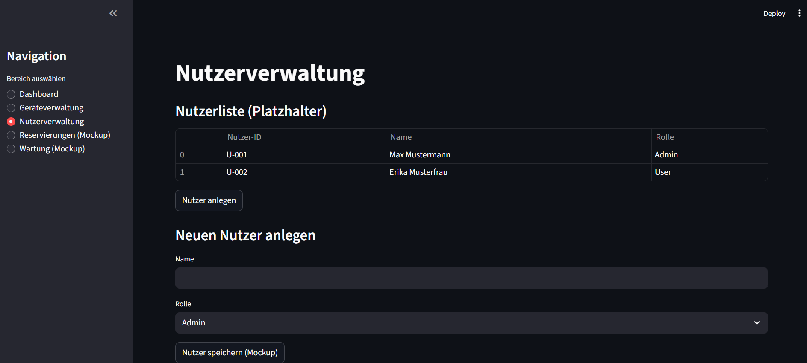

# Installation
## Setup virtual maschine
Go into the Project-Folder.
Open a terminal and type in this command to create the virtual maschine:
```
python -m venv .venv
```
Now there should be a folder named ".venv" in your project-folder.

### Activate and deactivate the virtual maschine
Open a terminal and make sure you selected the project-folder.
Use this command to start the virtual maschine:
```
.venv/Scripts/activate
```
Now there should see a green "(.venv)" before your path in the terminal.

To deactivate the virtual maschine use this command:
```
deactivate
```
Now the "(.venv)" should have disapered.

### Install the needed libraries:
Start the virtual maschine.
Use this command to install the wanted library (in our case its "streamlit"):
```
pip install streamlit
```
To look up the installed libraries use this command:
```
pip list
```

# Start script
## Start mockup
Make sure you are in the project-folder and open a terminal.
Use this command to start the mockup:
´´´
streamlit run mockup_ui.py
´´´

# Screenshot Mockup
